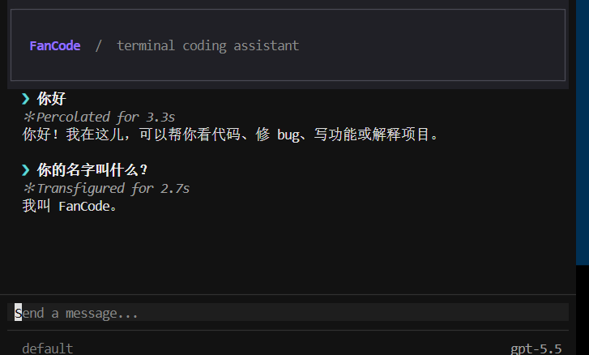

# FanCode

FanCode 是一个运行在终端中的 AI 编程助手。它通过 Anthropic、OpenAI 或兼容 OpenAI 协议的模型，为代码阅读、修改、调试、规划和项目协作提供交互式支持。



## 功能特性

- 终端交互式 TUI，支持流式输出、思考状态和工具调用展示
- 非交互模式，适合脚本和自动化任务
- 支持 Anthropic、OpenAI 及 OpenAI 兼容接口
- 文件读取与编辑、命令执行、代码检索和差异查看
- Plan 模式、权限控制与可选沙箱
- 会话恢复、上下文压缩和持久化记忆
- MCP（Model Context Protocol）服务器扩展
- Agent、后台任务和团队协作
- Git Worktree 管理
- 可选远程模式，通过浏览器访问 WebSocket UI

## 环境要求

- Python 3.11 或更高版本
- Git（使用 Worktree 功能时需要）
- 至少一个模型服务商的 API Key

## 安装

推荐使用 `uv`：

```bash
git clone <你的仓库地址>
cd fancode
uv sync
```

也可以使用 pip 安装当前项目：

```bash
pip install -e .
```

安装完成后，可通过以下命令确认入口可用：

```bash
fancode --help
```

## 配置

FanCode 从以下位置按顺序读取配置，并对已存在的配置进行合并：

- `~/.fancode/config.yaml`
- 当前项目的 `.fancode/config.yaml`
- 当前项目的 `.fancode/config.local.yaml`

最小配置示例：

```yaml
providers:
  - name: anthropic
    protocol: anthropic
    base_url: https://api.anthropic.com
    model: claude-3-7-sonnet-latest
    api_key: "${ANTHROPIC_API_KEY}"

permission_mode: default
enable_fork: true
enable_verification_agent: false
```

建议通过环境变量提供密钥，而不是直接写入配置文件：

```bash
# PowerShell
$env:ANTHROPIC_API_KEY = "你的 API Key"

# Bash / Zsh
export ANTHROPIC_API_KEY="你的 API Key"
```

可用协议和对应环境变量：

| 协议 | 环境变量 |
| --- | --- |
| `anthropic` | `ANTHROPIC_API_KEY` |
| `openai` | `OPENAI_API_KEY` |
| `openai-compat` | `OPENAI_API_KEY` |

## 使用方式

启动交互式终端界面：

```bash
fancode
```

非交互执行一次任务：

```bash
fancode -p "请检查当前项目中的异常处理，并给出修改建议"
```

输出 JSON 事件流：

```bash
fancode -p "总结项目结构" --output-format stream-json
```

覆盖权限模式：

```bash
fancode --mode plan
```

启动远程模式（默认监听 `0.0.0.0:18888`）：

```bash
fancode --remote
```

## 常用命令

在交互式界面中输入以下命令：

| 命令 | 说明 |
| --- | --- |
| `/help` | 查看帮助 |
| `/clear` | 清除当前对话 |
| `/plan` | 切换 Plan 模式 |
| `/review` | 审查代码变更 |
| `/status` | 查看当前状态 |
| `/session` | 列出、恢复、新建或删除会话 |
| `/memory` | 管理持久化记忆 |
| `/skill` | 查看和重新加载 Skill |
| `/mcp` | 查看 MCP 服务器状态 |
| `/tasks` | 查看或取消后台任务 |
| `/trace` | 查看 Agent 追踪树 |
| `/worktree` | 管理 Git Worktree |
| `/compact` | 压缩当前上下文 |

快捷键：`Ctrl+C` 退出，`Esc` 取消当前操作，`Shift+Tab` 切换权限模式，`Ctrl+O` 展开或收起工具调用。

## MCP 配置

在配置文件的 `mcp_servers` 中声明 MCP 服务器。服务器可以通过本地命令（stdio）或 HTTP 地址连接：

```yaml
mcp_servers:
  - name: filesystem
    command: npx
    args: ["-y", "@modelcontextprotocol/server-filesystem", "/path/to/project"]
```

## 开发与测试

安装开发依赖：

```bash
uv sync --dev
```

运行测试：

```bash
python -m pytest -q
```

运行 Python 编译检查：

```bash
python -m compileall -q fancode tests
```

## 数据与安全

运行时数据默认保存在项目或用户目录下的 `.fancode/` 中，包括配置、会话、调试日志和记忆文件。该目录已加入 Git 忽略列表。

命令执行和文件修改受权限模式控制。启用沙箱前，请确认当前操作系统和依赖已满足项目配置要求；不要在配置文件或提交记录中公开 API Key。

## 项目结构

```text
fancode/
├── app.py          # 终端 TUI
├── agent.py        # Agent 执行循环
├── client.py       # 模型客户端
├── commands/       # 交互式命令
├── tools/          # 内建工具
├── memory/         # 会话记忆
├── mcp/            # MCP 支持
├── teams/          # 团队协作
└── worktree/       # Git Worktree
tests/              # 测试
```
